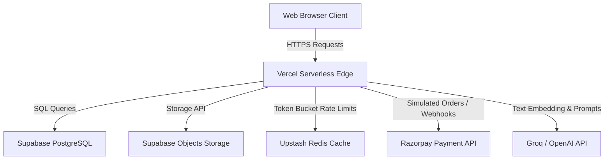

# CampusConnect System Architecture

This document maps out the system design and core components of CampusConnect.

---

## 🏗 System Components

---

## 📂 Project Structure
- **`/src/app/`**: Next.js App Router folders defining pages and backend API endpoints.
  - **`/api/`**: Serverless route handlers for checkouts, AI parsing, auth, and analytics.
- **`/src/components/`**: Client and Server UI components styled with vanilla CSS.
- **`/src/lib/`**: Core utilities:
  - `prisma.ts`: Database client lifecycle and pgBouncer reset handlers.
  - `featureFlags.ts`: Dynamic flags checking with caching.
  - `rate-limit.ts`: Token bucket limits checks.
  - `logger.ts`: Structured JSON observability loggers.
- **`/prisma/`**: Schema definitions, seeds, and RLS policies SQL scripts.
- **`/e2e/`**: Playwright responsive browser test specifications.
