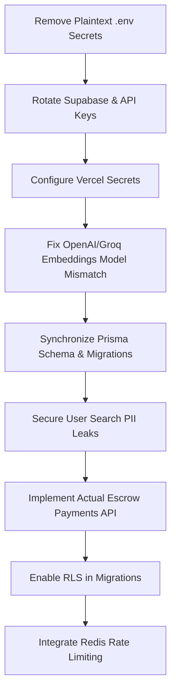

# Production Readiness Audit & Health Report: CampusConnect

This report presents a comprehensive production readiness audit of the **CampusConnect** project. The audit was conducted by inspecting the entire codebase, including dependencies, configuration, environment settings, database schemas, APIs, frontend components, and middleware.

---

## 1. Executive Summary

CampusConnect is a Next.js-based student gig marketplace and networking platform designed to connect students with startups and clients. The application incorporates a gamification engine (XP/level/reputation tracking), an AI career copilot, resume analysis, mock interview simulators, and an escrow-based gig payment system.

While the project features a modern architecture (Next.js 16, React 19, Turbopack, and Prisma) and a sleek visual design, a deep technical audit reveals **critical architectural gaps, severe security vulnerabilities, and major missing components** that prevent it from being production-ready.

**Critical highlights:**
*   **Non-functional Payment/Escrow System:** The payment system is entirely mocked. There is no gateway integration (Razorpay or DodoPayments) implemented in code, and the automatic escrow release cron job commits "fake" releases in the database.
*   **Severe Security Vulnerabilities:** Critical production secrets, including Supabase database credentials, Razorpay API keys, and Groq API keys, are committed in plaintext inside the repository's `.env` file. Furthermore, the search API exposes all users' emails without authentication.
*   **Out-of-Sync Database Migrations:** The schema has evolved significantly (adding gamification, ambassador tracking, connection requests, etc.), but the migrations history is completely out of sync, which will break deployments and local setups.
*   **Integration Crashes:** The AI embedding functionality is configured incorrectly, pointing a Groq API key to an OpenAI embedding model, which will result in runtime crashes.
*   **Zero Testing:** The repository contains absolutely no automated tests.

---

## 2. Current Project Status

The project is functional as a prototype, and the build succeeds under Turbopack/Next.js 16. However, it is **not production-ready** due to incomplete core business logic and critical security flaws.

*   **Code Compilation:** ✅ Success (`npx tsc --noEmit` and `npm run build` pass successfully)
*   **ESLint Status:** ⚠ Warnings (214 problems found, 0 errors, 214 warnings)
*   **Database Migrations:** ❌ Broken / Out of Sync
*   **Core Workflows:** ❌ Broken (AI Embeddings, Payments/Escrow)
*   **Testing:** ❌ Missing (0% coverage)

---

## 3. Overall Score

| Dimension | Score | Comments |
| :--- | :---: | :--- |
| **Architecture** | **65/100** | Good App Router structure, but suffers from isolated rate limiting and JS-bound vector computations. |
| **Security** | **20/100** | Plaintext credentials in repository, unauthenticated PII exposure in search, and RLS policies decoupled from migrations. |
| **Performance** | **60/100** | Lacks database-level vector search (`pgvector`); relies on in-memory array manipulation for recommendations. |
| **Scalability** | **45/100** | In-memory rate limiting fails on Edge/Serverless; lacks distributed state; missing critical indexes. |
| **Maintainability** | **55/100** | TypeScript safety bypassed with `as any` casts; multiple empty placeholder files; out-of-sync migrations. |
| **Testing** | **0/100** | No test runner configured; zero unit, integration, or E2E tests. |
| **Accessibility** | **65/100** | WebGL/GSAP visual elements lack fallback states; standard interactive elements lack ARIA/focus constraints. |
| **SEO** | **70/100** | robots.ts and sitemap.ts are well-formed, but legal pages are locked behind authentication due to middleware errors. |
| **Developer Experience** | **50/100** | Build completes, but lack of migration consistency and bypassed type safety will lead to silent database errors. |
| **Deployment Readiness** | **30/100** | Mocked payment gateway and hardcoded configs prevent staging/production deployment. |
| **OVERALL SCORE** | **46/100** | **🔴 Not Production Ready** |

---

## 4. Critical Issues

These issues must be resolved before the system can be deployed to any public environment.

### 4.1 Plaintext Secrets Committed in Codebase
*   **Location:** [.env](file:///Users/madhu/Downloads/campusconnectco.in-main/.env)
*   **Impact:** The database password, Supabase service keys, Razorpay credentials, and Groq/OpenAI keys are checked directly into the repository. Anyone with access to the source code can read/write the production database and abuse paid API keys.
*   **Remediation:** Remove all sensitive credentials from `.env` immediately. Utilize a `.env.example` file and configure secrets via the hosting platform (e.g., Vercel Project Settings, AWS Secrets Manager). Rotate all database passwords and API keys immediately.

### 4.2 Non-Functional/Mocked Escrow Payments
*   **Location:** [release-payments/route.ts:L48-52](file:///Users/madhu/Downloads/campusconnectco.in-main/src/app/api/cron/release-payments/route.ts#L48-L52)
*   **Impact:** The payments cron endpoint checks for completed transactions and automatically marks them as `RELEASED` in the database without performing any actual financial transfer. The code contains only a `TODO` comment:
    ```typescript
    // 4. TODO: Execute actual fund transfer via DodoPayments API
    // const payout = await dodoClient.payouts.create({...});
    const payoutSuccess = true; // Placeholder
    ```
    This creates an extreme financial risk where the database says payouts occurred, but no funds were moved, or vice-versa.
*   **Remediation:** Implement the actual payment gateway clients (Razorpay Route or DodoPayments SDK) and link payout creation to the transaction lifecycle. Ensure proper webhooks are set up to verify payout status before database mutations.

### 4.3 Broken AI Embedding Generation (Groq/OpenAI Mismatch)
*   **Location:** [embeddings.ts:L13-18](file:///Users/madhu/Downloads/campusconnectco.in-main/src/lib/ai/embeddings.ts#L13-L18) and [client.ts:L15-18](file:///Users/madhu/Downloads/campusconnectco.in-main/src/lib/ai/client.ts#L15-L18)
*   **Impact:** The application uses Groq API keys starting with `gsk_`. The AI client helper detects `gsk_` and overrides the base URL to `https://api.groq.com/openai/v1`. However, the code then attempts to call `openai.embeddings.create` requesting the model `text-embedding-3-small`. Groq does not host OpenAI's embedding models. This causes all profile/gig matches, vector assemblies, and embedding updates to fail with a `404/400 Model Not Found` error.
*   **Remediation:** Either supply a valid OpenAI API key for `text-embedding-3-small` or switch the embedding model to one supported by Groq (e.g., `nomic-embed-text-v1.5`) and update the vector dimensions to match (Groq is 768, OpenAI is 1536).

### 4.4 RLS Policies Out-of-Sync with Migrations
*   **Location:** [prisma/migrations/](file:///Users/madhu/Downloads/campusconnectco.in-main/prisma/migrations) and [prisma/supabase_rls_policies.sql](file:///Users/madhu/Downloads/campusconnectco.in-main/prisma/supabase_rls_policies.sql)
*   **Impact:** Row Level Security (RLS) is written in a separate SQL file, but there are no migrations to apply it. The single database migration in history represents an old, basic schema. Deploying this codebase will produce a database lacking RLS, allowing malicious users to bypass APIs and modify database records directly using the Supabase anonymous key.
*   **Remediation:** Integrate the schema changes and the RLS statements directly into the Prisma migration flow (e.g., using `prisma migrate dev --create-only` and appending custom RLS SQL commands).

---

## 5. High Priority Issues

These issues cause security leaks, performance issues, or broken user experiences.

### 5.1 User PII Leak via Public Search API
*   **Location:** [search/route.ts:L105-121](file:///Users/madhu/Downloads/campusconnectco.in-main/src/app/api/search/route.ts#L105-L121)
*   **Impact:** The `/api/search` endpoint is completely public (no `protectApi` call) and includes the raw `email` field in the user select object. Anyone can crawl this public search endpoint to extract the names and email addresses of all users on the platform.
*   **Remediation:** Remove `email` from the select block in the search query, or restrict search user lookups to authenticated sessions only.

### 5.2 Legal Pages Redirect to Login (UX & SEO Broker)
*   **Location:** [middleware.ts:L54-55](file:///Users/madhu/Downloads/campusconnectco.in-main/src/lib/supabase/middleware.ts#L54-L55)
*   **Impact:** The public route list in the Supabase session middleware permits `/terms` and `/privacy`. However, the actual page routes in the application are `/terms-and-conditions` and `/privacy-policy`. Consequently, any anonymous user (or search crawler) visiting the terms or privacy policy pages will be redirected to the sign-in screen, breaking compliance and search indexing.
*   **Remediation:** Correct the public routes array in the middleware:
    ```typescript
    path === '/terms-and-conditions' ||
    path === '/privacy-policy' ||
    path === '/refund-policy'
    ```

### 5.3 Memory Leak & Edge Failure in Middleware Rate Limiting
*   **Location:** [middleware.ts:L5-25](file:///Users/madhu/Downloads/campusconnectco.in-main/src/middleware.ts#L5-L25)
*   **Impact:** The global API rate limiter uses a local memory `Map` (`rateLimitMap`).
    1.  **Memory Leak:** Records are never cleaned up or deleted; they are only reset. Long-running servers will experience memory bloat.
    2.  **Edge Failures:** Next.js middleware runs on serverless/edge containers. Each container maintains its own memory. Rate limits will not be shared across instances, allowing users to easily bypass limits.
*   **Remediation:** Import and use the Redis-backed [RateLimiter](file:///Users/madhu/Downloads/campusconnectco.in-main/src/lib/rate-limit.ts) that was created but left unused.

### 5.4 Missing Indexes on Key Foreign Relations
*   **Location:** [prisma/schema.prisma](file:///Users/madhu/Downloads/campusconnectco.in-main/prisma/schema.prisma)
*   **Impact:** The database schema is missing indexing on heavily queried foreign key relations, which will lead to table scans as the dataset grows.
*   **Affected Relations:**
    *   `Post.authorId`
    *   `Project.userId` (critical for profile rendering)
    *   `Task.userId`
    *   `Review` (lacks indexes on `gigId`, `reviewerId`, and `revieweeId`)
    *   `CareerRoadmap.userId`
    *   `MockInterview.userId`
    *   `CopilotSession.userId`
*   **Remediation:** Add `@@index([foreignKeyField])` to these models in `schema.prisma` and generate a new migration.

---

## 6. Medium Priority Issues

### 6.1 Bypassing TypeScript via Type Castings (`as any`)
*   **Location:** [growth.ts:L15, L44, L59, L64, L73, L91, L103, L108, L117, L128, L141, L150, L160, L172](file:///Users/madhu/Downloads/campusconnectco.in-main/src/lib/growth.ts)
*   **Impact:** The referral and gamification engines cast `prisma` and the transaction context `tx` to `any` (e.g., `await (tx as any).userGamification.update(...)`). Bypassing compiler checks increases the risk of silent database query failures if schemas change, and hides structural errors from the linter.
*   **Remediation:** Regenerate the Prisma Client (`npx prisma generate`) to update its internal type definitions. Once regenerated, remove the `as any` casts and enforce proper static types.

### 6.2 Dead Code: 0-Byte Placeholder Files
*   **Location:** `src/lib/ai/` directory
*   **Impact:** The folder contains 11 empty files (e.g., `analyticsAI.ts`, `feedEngine.ts`, `fraudDetector.ts`, `searchAI.ts`, `sentimentEngine.ts`). This is dead code that clutters the workspace, makes dependencies unclear, and represents unfinished development.
*   **Remediation:** Delete these empty files or fill them with functional code.

### 6.3 Missing Image Optimization
*   **Location:** [LandingTestimonials.tsx](file:///Users/madhu/Downloads/campusconnectco.in-main/src/components/landing/LandingTestimonials.tsx), [CCNavbar.tsx](file:///Users/madhu/Downloads/campusconnectco.in-main/src/components/landing/CCNavbar.tsx), [CCFooter.tsx](file:///Users/madhu/Downloads/campusconnectco.in-main/src/components/landing/CCFooter.tsx), [CCCampusGigs.tsx](file:///Users/madhu/Downloads/campusconnectco.in-main/src/components/landing/CCCampusGigs.tsx), [MessagesLayout.tsx](file:///Users/madhu/Downloads/campusconnectco.in-main/src/components/messages/MessagesLayout.tsx), [NavbarClient.tsx](file:///Users/madhu/Downloads/campusconnectco.in-main/src/components/navigation/NavbarClient.tsx), [AvatarUpload.tsx](file:///Users/madhu/Downloads/campusconnectco.in-main/src/components/profile/AvatarUpload.tsx), [GigCard.tsx](file:///Users/madhu/Downloads/campusconnectco.in-main/src/components/ui/GigCard.tsx)
*   **Impact:** These files use raw `` tags instead of Next.js's `<Image />` component. This leads to slower LCP (Largest Contentful Paint) and higher bandwidth costs, as images are not auto-resized, lazy-loaded, or converted to modern web formats (WebP/AVIF).
*   **Remediation:** Replace all standard `` tags with `<Image />` from `next/image`.

### 6.4 Missing Test Runner Configuration
*   **Location:** [package.json](file:///Users/madhu/Downloads/campusconnectco.in-main/package.json)
*   **Impact:** There is no testing framework (like Vitest or Jest) installed, and there are no scripts to run tests. Changes to database logic or API routing are entirely unverified by automated systems.
*   **Remediation:** Install and configure Jest or Vitest, add a `"test": "vitest"` script to `package.json`, and write basic unit tests for helpers.

---

## 7. Low Priority Issues / Code Smells

*   **API Response Misuse (JSON Array vs. Object):** In [chatAssistant.ts:L92](file:///Users/madhu/Downloads/campusconnectco.in-main/src/lib/ai/chatAssistant.ts#L92), the OpenAI completions API is requested with `response_format: { type: 'json_object' }` but the system prompt instructs it to return a JSON array. This can lead to validation issues. The model should be instructed to return a JSON object with an array key (e.g. `{ "tips": [...] }`).
*   **SQLite Relics (`dev.db`):** There is a `dev.db` file in the `prisma` directory despite the provider being PostgreSQL. This should be cleaned up.
*   **Unused Imports and ESLint Directives:** ESLint reports warnings regarding unused variables and directives (e.g., `e` in `CCPageLoader.tsx`, `GraduationCap` in `MobileTabBar.tsx`, `props` in `MagneticButton.tsx`).
*   **In-Memory Vector Search Scale Limit:** The cosine similarity checks in [embeddings.ts](file:///Users/madhu/Downloads/campusconnectco.in-main/src/lib/ai/embeddings.ts) are performed in JS memory. For a large userbase, downloading all user/gig vectors to memory to rank them will block the server and result in severe latency.

---

## 8. Summary of Features Status

| Feature | Status | Comments |
| :--- | :---: | :--- |
| **Authentication & Authorization** | 🟢 Complete | Supabase JWT & DB-level role checks are robust. |
| **Onboarding & Profiles** | 🟢 Complete | Functional forms, branch/college categorization, avatar uploads. |
| **Gig Creation & Applications** | 🟢 Complete | Standard CRUD flow with notifications works. |
| **Resume Parsing & Review** | 🟡 Partial | PDF extracting and scoring works, but depends on fixing the OpenAI client key. |
| **Career Copilot & Mock Interviews** | 🟡 Partial | History persistence works, but relies on broken OpenAI integration. |
| **Gamification Engine** | 🟡 Partial | Score calculation and XP event tracking are written but type-safety is bypassed. |
| **Campus Ambassadors & Referral Loop** | 🟡 Partial | Referral links and bonus calculation work, but depend on payments. |
| **Payments / Escrow** | 🔴 Incomplete | Escrows are never created; release endpoint uses mock success placeholder. |

---

## 9. Recommendations & Immediate Next Steps



### Immediate Action Plan (Sprint 1)
1.  **Secret Scrubbing:** Move all secrets out of [.env](file:///Users/madhu/Downloads/campusconnectco.in-main/.env). Create a `.env.example`. Configure environments properly.
2.  **Fix AI Model Configurations:** Update [embeddings.ts](file:///Users/madhu/Downloads/campusconnectco.in-main/src/lib/ai/embeddings.ts) and [client.ts](file:///Users/madhu/Downloads/campusconnectco.in-main/src/lib/ai/client.ts) to correctly route embeddings requests.
3.  **Restore Migration Sync:** Run `npx prisma migrate diff` against the Supabase database, create a clean migration representing the current schema state, and apply it.
4.  **Fix Middleware Routing:** Correct the public routes array in [middleware.ts](file:///Users/madhu/Downloads/campusconnectco.in-main/src/lib/supabase/middleware.ts) to match the true paths of the legal pages.
5.  **Remove Email Exposure:** Remove the `email` field from the select statement of the search query in [search/route.ts](file:///Users/madhu/Downloads/campusconnectco.in-main/src/app/api/search/route.ts).

---

## 10. Final Verdict

### 🔴 Not Production Ready

The project contains outstanding security vulnerabilities (plaintext database credentials and public email exposure), and the payment/escrow system is completely non-functional. It cannot be launched in its current state.

*   **Estimated Engineering Effort:** 60 - 80 hours (mainly for payment integration, webhook handlers, migration syncing, and RLS deployment).
*   **Estimated Time to Production:** 2 - 3 weeks (assuming 1 full-time developer).
